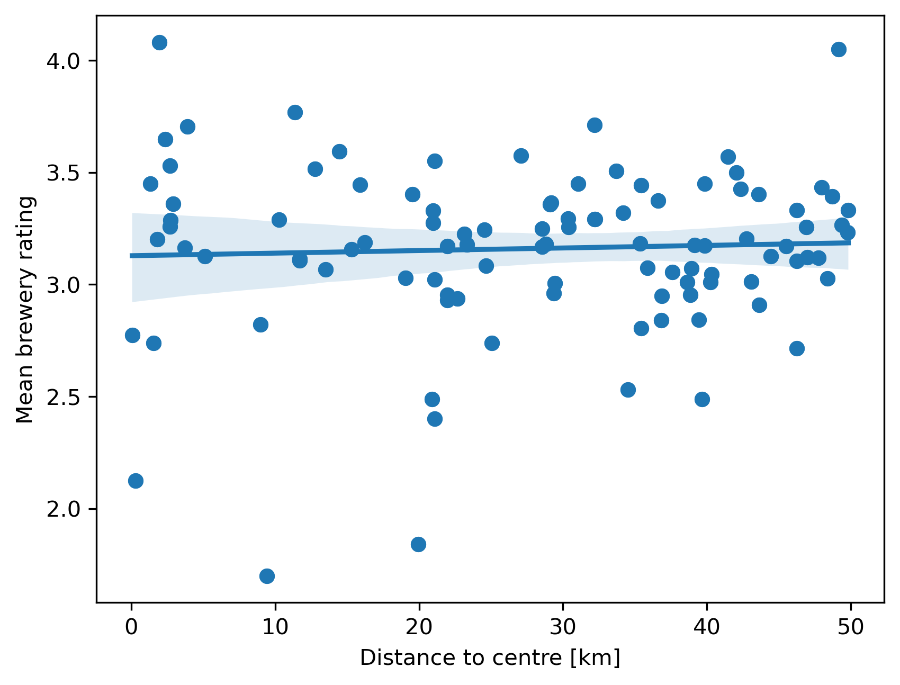

## Motivation

&nbsp;&nbsp;&nbsp;&nbsp; Breweries are becoming more and more popular nowadays, each of them proposing beers with unique flavors. Appreciated by casual beer drinkers and craft beer enthusiasts, beers happen to be a thriving market. A rising amount of new breweries have emerged in the last decades. When starting a new brewery, the choice of location of the brewery is a significant step to guarantee its success.  

&nbsp;&nbsp;&nbsp;&nbsp; There are several factors to consider when choosing a location for a brewery such as the access to raw materials (water, hops, barley, and yeast), the proximity to customers, zoning laws and regulations, costs of renting or buying property, and competition with other breweries.  

## Goal

&nbsp;&nbsp;&nbsp;&nbsp; Throughout this project, we will try to give some tools for brewers to help them to choose the location of their future brewery by answering some research questions.

## Research questions

&nbsp;&nbsp;&nbsp;&nbsp; Is a brewery inside a city more inclined to be successful?

&nbsp;&nbsp;&nbsp;&nbsp; Which regions are more conducive to which style of beer?

## Methodology

&nbsp;&nbsp;&nbsp;&nbsp; We used a dataset on beer reviews provided by RateBeer website which collected over 7 millions reviews for a period of 17 years (2001-2017). It includes :
- metadata about 442k beers, 24k breweries, and 70k users
- ratings across different aspects: appearance, aroma, palate, taste
- textual review

&nbsp;&nbsp;&nbsp;&nbsp; Heatmap of reviews

&nbsp;&nbsp;&nbsp;&nbsp; Basic analysis on those datas shows the different appreciations on beer styles. The most prefered one is imperial stout with a mean rating of 3,85. The less prefered one is malt liquor with a mean rating of 1,92.

&nbsp;&nbsp;&nbsp;&nbsp; For further analysis, we needed to obtain precise location of breweries with API queries. 

## Expliquer combien ont été discard car mal placés montrer clusters par ville, combien de brasseries classifiées en ville et hors de villes? etc… 
&nbsp;&nbsp;&nbsp;&nbsp; Using the google API queries, not all breweries locations could be found. In a first step, all breweries where no location where found have been discarded, i.e., (2555 breweries). After that step, the breweries that were classified in the wrong country where also removed (XXX breweries) and we considered that the rest of the breweries where correctly classified. Then, using a shapefile that had the major cities in the world (i.e XXX cities), it was possible to extract which breweries where inside of a city and which breweries where outside of a city. Thiss resulted in XXX breweries in the city and XXX breweries outside of the city.

### Boxplot rating comparison ville/campagne

{:style="display: block; margin-left: auto; margin-right: auto;" width="600"}

<i>Figure: example</i>

The boxplot shows us a small difference in rating between urban and rural breweries, nothing significant enough to prove a difference in quality between both. The analysis of the outliers tells us the following:

<table align="center">
  <tr>
    <th></th>
    <th>Urban</th>
    <th>Rural</th>
  </tr>
  <tr>
    <th>Number of outliers</th>
    <th>344</th>
    <th>182</th>
  </tr>
  <tr>
    <th>Percentage of outliers</th>
    <th>6.58 %</th>
    <th>3.54 %</th>
  </tr>
</table>

The urban breweries induce more one-sided opinions, which means that they more often provide very good or very poor results. In fact, the huge majority of outliers, more than 90% of them, are "black sheeps" ones as they are below the minimum line of the boxplot. Hence, breweries not in the average cluster tend to perform bad more often than god. This tendency is also noticed with rural breweries, but the ratio of them beeing outliers is smaller, therefore rural breweries are less often "very bad". That's +1 for rural beer factories.

### carte de densité brasseries

### Linear-regression rating ville/campagne en fonction de la distance
{:style="display: block; margin-left: auto; margin-right: auto;" width="600"}

<i>Figure: example</i>

The correlation is clearly low, as moving one kilometer away from the city center changes the rating of the brewery of 0.001, which is equal to a change of 0.1 per 100km of distance from the closest city center. The city considered are often pretty big, which can results in a large distance from the city center even for breweries located inside the cities. The average distance from the nearest city center for rural and urban breweries is **45.27km** and **10.13km** respectively, which is not that a big difference.  

It's interesting to take a look at which users are rewieving the beers, as that might influence the results in favor of one party or another.

### Barplot nombre de reviews par location user pour montrer confounder
{:style="display: block; margin-left: auto; margin-right: auto;" width="600"}

<i>Figure: example</i>

Our reviews are mostly coming from the other side of the Atlantic. The Americans reviewed up to 5 times more beers than the second most represented country, United Kingdom. The American are more generous with the ratings compared to the average: the mean rating coming from American prople is **add value**, and the average rating for total reviews is 3.29.

{:style="display: block; margin-left: auto; margin-right: auto;" width="600"}

<i>Figure: example</i>

{:style="display: block; margin-left: auto; margin-right: auto;" width="600"}

<i>Figure: example</i>

### linear regression sur Munich

