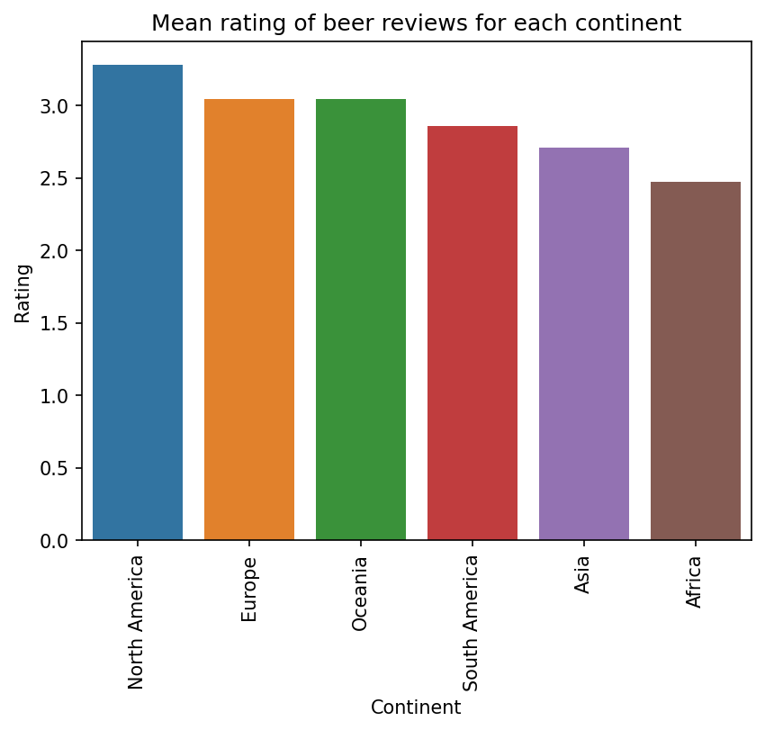
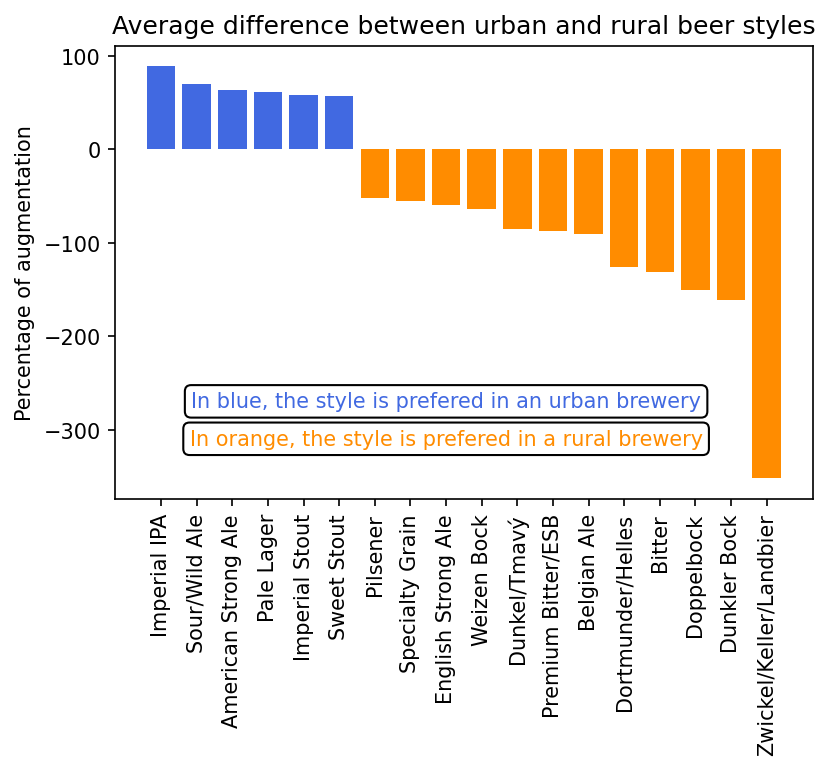

## Motivation

&nbsp;&nbsp;&nbsp;&nbsp; Breweries are becoming more and more popular nowadays, each of them proposing beers with unique flavors. Appreciated by casual beer drinkers and craft beer enthusiasts, beers happen to be a thriving market. A rising amount of new breweries have emerged in the last decades.  When starting a new brewery, the choice of location of the brewery is a significant step to guarantee its success. 

&nbsp;&nbsp;&nbsp;&nbsp; There are several factors to consider when choosing a location for a brewery such as the access to raw materials (water, hops, barley, and yeast), the proximity to customers, zoning laws and regulations, costs of renting or buying property, and competition with other breweries. For this project, we were interested to distinguish the difference between urban and rural breweries. 

## Goal

&nbsp;&nbsp;&nbsp;&nbsp; This projects aims to give advice to new brewers and indicate if they should install themselves in a crowded city or in the calm countryside. A look will also be given into beer styles and what differences can be found between beer crafted in urban area and in rural area.

## Research questions

- Are there major differences between urban and rural breweries? 
- Do breweries in big cities perform better in general? 
- Is it the same for small breweries ?
-  Are there specific features related to urban or rural breweries?

## Dataset description

&nbsp;&nbsp;&nbsp;&nbsp; We used a dataset on beer reviews provided by the RateBeer website which collected over 7 millions reviews for a period of 17 years (2001-2017). It includes :
- metadata about 442k beers, 24k breweries, and 70k users
- ratings across different aspects: appearance, aroma, palate and taste
- a textual review
- users' and breweries' country
- beer styles

&nbsp;&nbsp;&nbsp;&nbsp; The distribution of reviews on different styles over time allow us to observe that between 2013 and 2016 India Pale Ale (IPA), Imperial Stout, Imperial IPA, and American Pale Ale received the major part of reviews.

&nbsp;&nbsp;&nbsp;&nbsp; Basic analysis on those datas shows the different appreciations on beer styles. The most prefered one is imperial stout with a mean rating of 3,85. The less prefered one is malt liquor with a mean rating of 1,92.

&nbsp;&nbsp;&nbsp;&nbsp; For further analysis, we needed to obtain precise location of the breweries all over the world with Google Maps API. The following interactive map shows the density of breweries around the world with two main clusters in the United States of America and Europe.

## Methodology

&nbsp;&nbsp;&nbsp;&nbsp; Using the google API queries, not all breweries locations could be found. In a first step, all breweries where no location where found have been discarded. In a second step, all the breweries classified in the wrong countries have also been removed. All the other breweries where considered as correctly classified for the analysis. Using a shapefile which had the major cities in the world (6018), it was then possible to determine how many breweries are inside a city and how many breweries are outside of a city. Moreover, the beers which had less than 3 reviews have also been removed in order to avoid biased ratings.

### Distance to the closest city
&nbsp;&nbsp;&nbsp;&nbsp; The next data thats needs to be found is the distance of each brewery to the closest city around it. To compute it, the position of the 6000 of the biggest cities of the world, including capitals end major cities from every country were needed. 

### Boxplot rating comparison between urban and rural breweries

{:style="display: block; margin-left: auto; margin-right: auto;" width="600"}

The boxplot shows us a small difference in rating between urban and rural breweries, nothing significant enough to prove a difference in quality between both. The analysis of the outliers tells us the following:

<table align="center">
  <tr>
    <th></th>
    <th>Urban</th>
    <th>Rural</th>
  </tr>
  <tr>
    <th>Number of outliers</th>
    <th>344</th>
    <th>182</th>
  </tr>
  <tr>
    <th>Percentage of outliers</th>
    <th>6.58 %</th>
    <th>3.54 %</th>
  </tr>
</table>

The urban breweries induce more one-sided opinions, which means that they more often provide very good or very poor results. In fact, the huge majority of outliers, more than 90% of them, are "black sheeps" ones as they are below the minimum line of the boxplot. Hence, breweries not in the average cluster tend to perform bad more often than good. This tendency is also noticed with rural breweries, but the ratio of them beeing outliers is smaller, therefore rural breweries are less often "very bad". That's +1 for rural beer factories.

{:style="display: block; margin-left: auto; margin-right: auto;" width="700"}

<i>Figure: Density map of breweries across Europe</i>

{:style="display: block; margin-left: auto; margin-right: auto;" width="700"}

The correlation is clearly low, as moving one kilometer away from the city center changes the rating of the brewery of 0.001, which is equal to a change of 0.1 per 100km of distance from the closest city center. The city considered are often pretty big, which can results in a large distance from the city center even for breweries located inside the cities. The average distance from the nearest city center for rural and urban breweries is **45.27km** and **10.13km** respectively, which is not that a big difference.  

It's interesting to take a look at which users are rewieving the beers, as that might influence the results in favor of one party or another. Here is a plot with the 4 countries that rated the most beers. 

### Barplot to illustrate the possible cofounders
{:style="display: block; margin-left: auto; margin-right: auto;" width="700"}

Our reviews are mostly coming from the other side of the Atlantic. The Americans reviewed up to 5 times more beers than the second most represented country, United Kingdom. The American are more generous with the ratings compared to the average: the mean rating coming from American prople is 3.39, and the average rating for total reviews is 3.11. The plot below shows that the beers are rated much better in North America than in Africa. But is that because breweries are better in America or is it because Americans rate breweries better ? Maybe another group answered this interesting question, but we always have to be aware that some cofounding factors may exist.

{:style="display: block; margin-left: auto; margin-right: auto;" width="600"}

<i>Figure: Average differences in beer styles: urban and rural breweries</i>

 
## Case study: small breweries in Brussels
&nbsp;&nbsp;&nbsp;&nbsp; So it seems that globally, no trend can be found with the remoteness of breweries. But what about it on a local scale ?
And couldn't this effect be linked to the size and relative popularity of breweries ?
For this case study, we'll take a look at the wonderful city of Brussels with its many breweries. To take only small businesses into account, we select breweries with fewer than 100 reviews and in a 50 kilometers radius around the city centre, which brings us to a sample of 102 points.

{:style="display: block; margin-left: auto; margin-right: auto;" width="700"}

<i>Figure: Map of Brussels with local small breweries</i>

The breweries are categorized into three sets.  
In the old city centre: 0-2 km 
Further into the city: 0-15 km 
In the periphery of Brussels: 15-50 km 
Those categories are displayed as circles on the above figure.

Our null hypothesis being that the distance to the city centre doesn't affect the breweries' ratings, our alternative hypothesis is that a negative correlation can be found between the two, indicating that remote breweries are less successful according to RateBeer data.
A linear regression was performed, both directly between the mean rating and the distance and with the categories (as dummy variables). 
In both cases, the p-values indicates that we can't reject our null hypothesis.

{:style="display: block; margin-left: auto; margin-right: auto;" width="700"}

<i>Figure: Linear regression between the breweries mean rating and their distance to Brussels' centre</i>

This analysis was also performed in Munich and Zurich and no significant results were found either.

## Beer styles location analysis
&nbsp;&nbsp;&nbsp;&nbsp; Using the styles provided by the reviews's metadata, we can highlight net differences between beer styles produced in urban and in rural areas. This could be explained by brewing traditions, different tastes in beer drinkers or availability of raw materials for example.  
To get a sense of the favorite styles per location, we calculated the favorite beer style produced by each brewery.
On the plot below, we observe that the Imperial Stout is the most liked style across the world, with 10% of every urban brewery having it as their best style according to their customers.

{:style="display: block; margin-left: auto; margin-right: auto;" width="700"}

{:style="display: block; margin-left: auto; margin-right: auto;" width="700"}

Now let's see what differences can be found between our two locations. We computed the differences between the number of urban and rural breweries for every style, divided by the number of breweries in each case. We also removed styles that had too few occurances as they wer not significant. This plot shows those differences in percentage of increase, meaning for example that Zwickel, Keller und Landbier occur ~four times more as the best style of remote breweries than main cities' breweries. 

{:style="display: block; margin-left: auto; margin-right: auto;" width="700"}

<i>Figure: Average differences in beer styles: urban and rural breweries</i>

## Conclusion
&nbsp;&nbsp;&nbsp;&nbsp; So what ?
Where sould you put your brand new brewery and your plans to craft specialty beer from your region ?  
Well good news, it doesn't matter if you chose to install yourself in the city or 50km outside of it, at least on how your beers may be appreciated. Other factors, such as the rent, access to clean water, if you want to build a taproom and if you're Head Brewer has a sens of taste for example, all have their importance ! But as long as you find spots and bars to sell your beers, it doesn't matter where you're located.  
However, some styles of beer are strongly typed and belong more traditionnaly to outer town. So if you're star beer is supposed to be an Imperial Stout, then you have statitically better chances in the cities.

